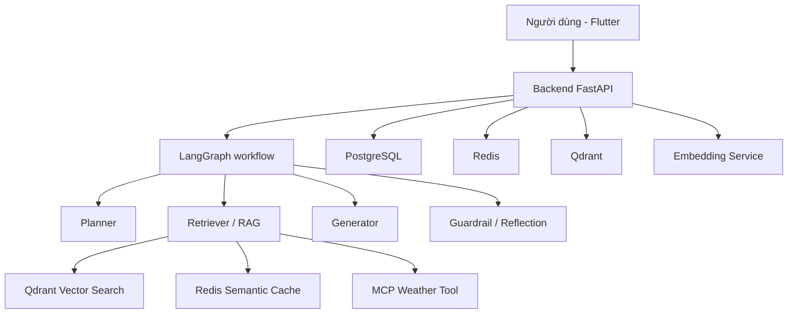

# AgriMind

AgriMind là một hệ thống AI hỏi đáp cho lĩnh vực nông nghiệp, kết hợp FastAPI, LangGraph, RAG, Qdrant, Redis, PostgreSQL, và Flutter.

## Mục tiêu

- hỗ trợ người dùng đặt câu hỏi liên quan đến nông nghiệp;
- tra cứu tài liệu chuyên môn từ kho dữ liệu đã được ingest;
- tạo câu trả lời có căn cứ, có trích dẫn và có kiểm soát an toàn;
- lưu lại ngữ cảnh người dùng và cải thiện trải nghiệm qua memory và cache.

## Kiến trúc tổng thể



## Công nghệ chính

- Backend: Python, FastAPI, LangGraph
- Frontend: Flutter
- Vector DB: Qdrant
- Cơ sở dữ liệu: PostgreSQL
- Cache: Redis
- Embedding/Reranking: Python service riêng
- Auth: Supabase JWT
- Observability: Langfuse

## Cấu trúc thư mục

```text
backend/
  app/
    api/
    core/
    repository/
    retrieval/
    services/
    tools/
    workflow/
  tests/

embedding-service/

frontend_flutter/

vision_training/       # pipeline fine-tune offline; không nằm trong runtime production

docker-compose.yml
```

## Chạy hệ thống bằng Docker

```bash
docker compose up --build
```

Các dịch vụ chính:
- backend: http://localhost:8000
- embedding-service: http://localhost:8001
- qdrant: http://localhost:6333
- postgres: localhost:5432
- redis: localhost:6379
- mcp weather server: localhost:8002

## Chạy backend local

```bash
cd backend
pip install -r requirements.txt
uvicorn app.main:app --reload
```

## Chạy frontend Flutter

```bash
cd frontend_flutter
flutter pub get
flutter run
```

## API chính

- POST /api/v1/chat/stream: gửi câu hỏi và nhận kết quả SSE
- POST /api/v1/documents/upload: upload PDF và ingest tài liệu
- POST /api/v1/documents/ingest: ingest nội dung văn bản
- GET /api/v1/documents: liệt kê tài liệu
- GET /api/v1/health: kiểm tra trạng thái hệ thống

## Trạng thái hiện tại

Dự án hiện đang ở mức MVP với các thành phần cốt lõi đã hoạt động:
- API chat
- workflow agent
- retrieval đa tầng
- vector search bằng Qdrant
- caching semantic bằng Redis
- memory người dùng
- auth và document ingestion
- frontend cơ bản

## Ghi chú

Một số cấu hình nhạy cảm như API key nên được đặt trong file .env và không commit vào Git.

## Fine-tune thị giác (tomato v1)

`vision_training/` là workspace độc lập để thu thập ảnh, kiểm tra manifest,
fine-tune MobileNetV3-Small và export ONNX. Nó không bật vision runtime và không
đưa PyTorch vào backend production. Xem hướng dẫn tại
[`vision_training/README.md`](vision_training/README.md).

Backend có adapter Gemini Flash đa cây phía sau `VISION_ANALYSIS_ENABLED=false`.
Adapter chỉ tạo quan sát thị giác typed để mở rộng truy vấn RAG; nó không tự chẩn
đoán hoặc đưa liều lượng. Đặt model bằng `MODEL_VISION`, nhưng chỉ bật feature flag
sau khi model vượt bộ đánh giá ảnh thực địa và OOD có phiên bản.
Trong giai đoạn manual QA, điền email test vào `VISION_TEST_USER_EMAILS` để thử
qua Flutter trong khi global flag vẫn tắt.
