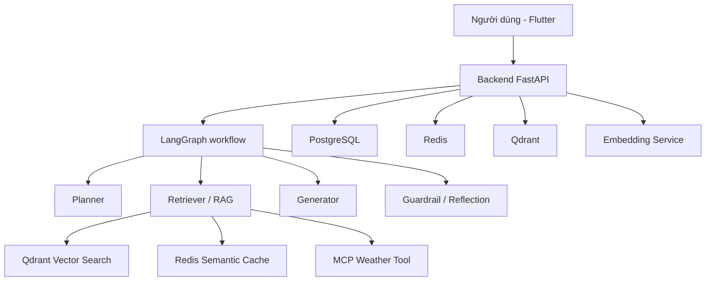

# AgriMind

AgriMind là nền tảng trợ lý và vận hành nông nghiệp, kết hợp FastAPI,
LangGraph, hybrid RAG, Qdrant, Redis, PostgreSQL và Flutter.

Đọc bản đồ đầy đủ tại
[`docs/architecture/system-overview.md`](docs/architecture/system-overview.md)
hoặc bắt đầu từ [`docs/README.md`](docs/README.md).

## Mục tiêu

- hỗ trợ người dùng đặt câu hỏi liên quan đến nông nghiệp;
- tra cứu tài liệu chuyên môn từ kho dữ liệu đã được ingest;
- tạo câu trả lời có căn cứ, có trích dẫn và có kiểm soát an toàn;
- lưu lại ngữ cảnh người dùng và cải thiện trải nghiệm qua memory và cache.

## Kiến trúc tổng thể



## Công nghệ chính

- Backend: Python, FastAPI, LangGraph
- Frontend: Flutter
- Vector DB: Qdrant
- Cơ sở dữ liệu: PostgreSQL
- Cache: Redis
- Embedding/Reranking: Python service riêng
- Auth: Supabase JWT
- Observability: Langfuse

## Cấu trúc thư mục

```text
backend/
  app/
    api/routes/         # FastAPI routes
    core/               # cấu hình, auth, DB và external clients
    persistence/        # SQLAlchemy entities
    retrieval/          # dense/BM25/fusion/rerank
    multimodal/         # image contract và validation
    services/           # application services
    tools/              # MCP/weather clients
    workflow/           # LangGraph state và nodes
    workers/            # công việc nền
  eval/                 # benchmark và dataset offline
  migrations/
  tests/
embedding-service/      # BGE-M3 + reranker
frontend_flutter/lib/
  app/                  # bootstrap, auth gate, navigation
  data/                 # DTO và API services
  design_system/        # tokens, Material theme, shared components
  features/             # UI theo từng tính năng
vision_training/        # fine-tune/eval offline; không thuộc runtime production
docs/                   # architecture, design-system, quality, reviews
docker-compose*.yml
```

## Chạy hệ thống bằng Docker

```bash
docker compose up --build
```

Các dịch vụ chính:
- backend: http://localhost:8000
- embedding-service: http://localhost:8001
- qdrant: http://localhost:6333
- postgres: localhost:5432
- redis: localhost:6379
- mcp weather server: localhost:8002

## Chạy backend local

```bash
cd backend
pip install -r requirements.txt
uvicorn app.main:app --reload
```

## Chạy frontend Flutter

```bash
cd frontend_flutter
flutter pub get
flutter run
```

## API chính

- POST /api/v1/chat/stream: gửi câu hỏi và nhận kết quả SSE
- POST /api/v1/documents/upload: upload PDF và ingest tài liệu
- POST /api/v1/documents/ingest: ingest nội dung văn bản
- GET /api/v1/documents: liệt kê tài liệu
- GET /api/v1/health: kiểm tra trạng thái hệ thống

## Trạng thái hiện tại

Dự án đang ở mức release candidate cuối Phase 4: chat SSE, LangGraph, hybrid
RAG, guardrail, memory, Vision theo allowlist và Farm Agent đều đã tích hợp.
Challenger fingerprint `cb3562e84674bbe8` (`safety-v7/prompts-v7/kb-v3`, text
role dùng `gemini-3.5-flash-lite`) đã qua benchmark production-workflow 20 câu,
golden v2 và Vision 24 ảnh. Backend champion dùng model khác nên giữ fingerprint
và report riêng; không được gán report challenger cho champion. Rollout rộng vẫn
thực hiện có kiểm soát; Vision toàn cục không tự bật sau benchmark. Xem ma trận bằng chứng tại
[`docs/reviews/phase-1-4-release-review.md`](docs/reviews/phase-1-4-release-review.md).

Gateway model có timeout, retry 5xx có giới hạn và circuit breaker riêng theo
vai trò model. Mặc định ba request lỗi liên tiếp sẽ mở circuit trong 60 giây để
không tiếp tục gọi provider khi đang lỗi hoặc hết quota; cấu hình bằng
`MODEL_CIRCUIT_FAILURE_THRESHOLD` và `MODEL_CIRCUIT_COOLDOWN_SECONDS`.

## Ghi chú

Một số cấu hình nhạy cảm như API key nên được đặt trong file .env và không commit vào Git.

## Fine-tune thị giác (tomato v1)

`vision_training/` là workspace độc lập để thu thập ảnh, kiểm tra manifest,
fine-tune MobileNetV3-Small và export ONNX. Nó không bật vision runtime và không
đưa PyTorch vào backend production. Xem hướng dẫn tại
[`vision_training/README.md`](vision_training/README.md).

Backend có adapter Gemini Flash đa cây phía sau `VISION_ANALYSIS_ENABLED=false`.
Adapter chỉ tạo quan sát thị giác typed để mở rộng truy vấn RAG; nó không tự chẩn
đoán hoặc đưa liều lượng. `gemini-3.1-flash-lite` đã vượt baseline ảnh thật
`safety-v3/prompts-v3`; challenger `safety-v7/prompts-v7/kb-v3` cũng đã đạt
promotion gate đủ 24 ảnh, không timeout, với grounded/citation/guardrail và safe
answer đều 100%. Rollout toàn cục vẫn default-off để triển khai theo đợt.
Trong giai đoạn manual QA, điền email test vào `VISION_TEST_USER_EMAILS` để thử
qua Flutter trong khi global flag vẫn tắt.
