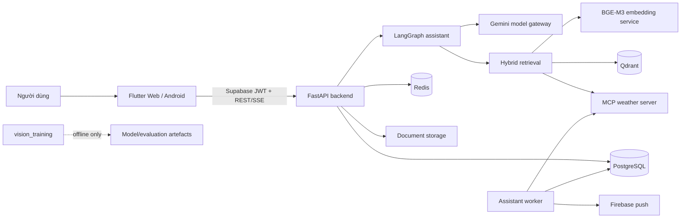
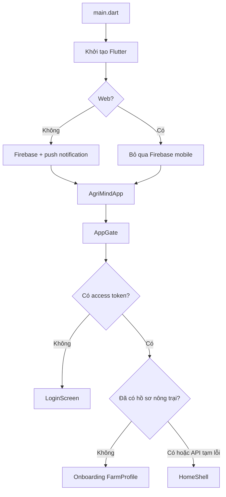
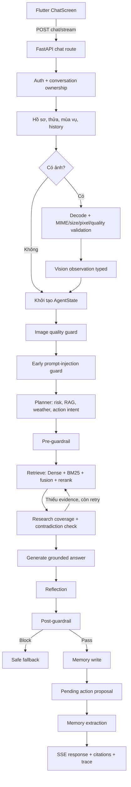
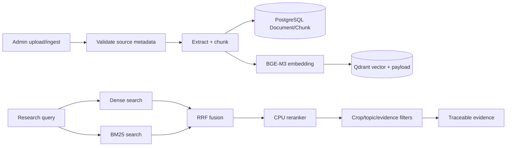
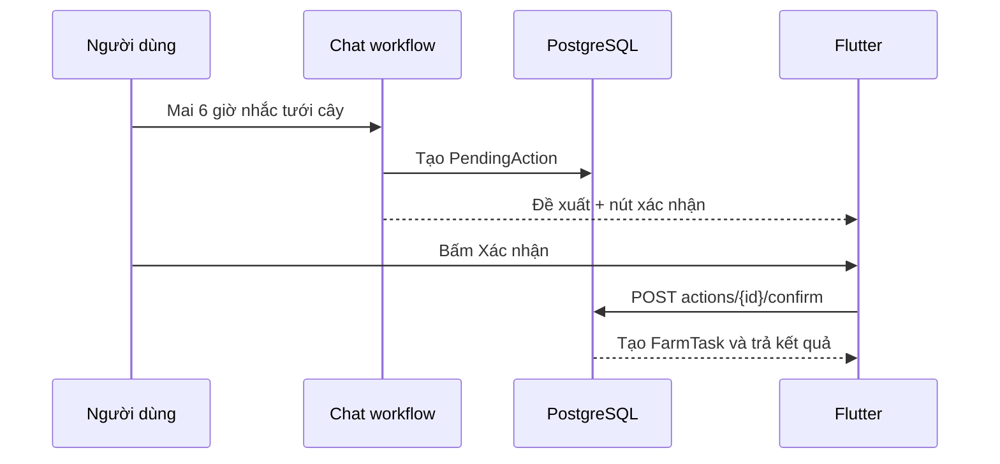

# Tổng quan hệ thống AgriMind

## 1. AgriMind là gì?

AgriMind là nền tảng trợ lý nông nghiệp gồm hai phần gắn với nhau:

- **Trợ lý AI có căn cứ:** nhận câu hỏi hoặc ảnh, lấy ngữ cảnh nông trại, tìm
  tài liệu liên quan, kiểm tra an toàn và trả lời có trích dẫn.
- **Quản lý vận hành nông trại:** quản lý thửa đất, mùa vụ, công việc, lịch theo
  dõi, thông báo và hành động do AI đề xuất nhưng chỉ thực thi sau xác nhận.

Flutter là giao diện production duy nhất. Luồng chat production duy nhất là
`POST /api/v1/chat/stream` và trả dữ liệu theo SSE.

## 2. Bản đồ thành phần



| Thành phần | Trách nhiệm |
|---|---|
| `frontend_flutter/` | Đăng nhập, chat SSE, tác vụ, thông báo và quản lý nông trại |
| `backend/app/api/routes/` | HTTP boundary, auth, ownership và request/response |
| `backend/app/workflow/` | LangGraph, state, planner, retrieval, generation, guardrail, memory |
| `backend/app/retrieval/` | Dense + BM25, fusion, rerank và evidence metadata |
| `backend/app/multimodal/` | Kiểm tra ảnh và observation schema; không tự chẩn đoán |
| `backend/app/persistence/` | SQLAlchemy entities cho dữ liệu nghiệp vụ và audit |
| `backend/app/workers/` | Nhắc việc, theo dõi thời tiết, notification outbox và push retry |
| `embedding-service/` | BGE-M3 embedding và reranker độc lập; GPU overlay tùy chọn |
| `backend/mcp_servers/` | Weather tool boundary qua MCP |
| `backend/eval/` | Dataset, benchmark và công cụ đánh giá offline |
| `vision_training/` | Workspace huấn luyện/đánh giá offline, không thuộc runtime production |

## 3. Luồng khởi động ứng dụng



`HomeShell` giữ bốn khu vực trong `IndexedStack`: **Trợ lý**, **Công việc**,
**Thông báo** và **Nông trại**. Badge công việc/thông báo được cập nhật định kỳ
và khi ứng dụng quay lại foreground.

## 4. Luồng chat văn bản và ảnh



Điểm quan trọng:

- Ảnh thô/base64 chỉ tồn tại tạm ở API boundary, không đi vào checkpoint,
  memory, cache hoặc log.
- Vision chỉ tạo quan sát xác suất. Khuyến nghị từ ảnh vẫn phải qua RAG và citation.
- Câu hỏi thuốc, hóa chất và liều lượng được phân loại rủi ro cao; nội dung chỉ
  tới client sau post-guardrail.
- `conversation_id` là `thread_id` ổn định của Postgres checkpointer và luôn
  được cách ly theo người dùng.

## 5. Luồng RAG và tài liệu



Mỗi evidence giữ `document_id`, `chunk_id`, source, version, active status và
score để citation ở câu trả lời truy ngược được tới chunk gốc. Deactivate là xóa
mềm khỏi retrieval; purge mới là xóa vật lý có kiểm soát.

## 6. Luồng tạo việc và xác nhận hành động

AI không ghi dữ liệu ngay khi người dùng nói “nhắc tôi”. Workflow tạo
`PendingAction` có chủ sở hữu và hạn dùng. Flutter hiển thị nút **Xác nhận/Hủy**.



Action hết hạn, bị hủy hoặc không thuộc người dùng hiện tại không được tạo dữ liệu.

## 7. Luồng worker, nhắc việc và thông báo

`assistant-worker` chạy độc lập với API để request chat không phải chờ công việc nền:

1. tìm `FarmTask` tới hạn và tạo notification có `dedupe_key`;
2. chạy lịch theo dõi thửa/mùa vụ, gọi MCP weather và lưu observation/risk;
3. tạo recommendation/task khi policy đủ điều kiện;
4. ghi `NotificationDelivery` vào outbox;
5. gửi Firebase push, retry có backoff khi thất bại;
6. hết hạn recommendation/action không còn hợp lệ.

Tất cả so sánh thời gian nghiệp vụ dùng `Asia/Ho_Chi_Minh`.

## 8. Dữ liệu đang có trong PostgreSQL

| Nhóm | Entities |
|---|---|
| Tài khoản/hội thoại | `User`, `Conversation`, `Message`, `MemoryFact` |
| Nông trại | `FarmProfile`, `FarmPlot`, `CropSeason`, `FarmLog` |
| Công việc/agent | `FarmTask`, `FarmMonitoringSchedule`, `FarmWeatherObservation`, `FarmRiskPrediction`, `FarmRecommendation`, `PendingAction` |
| Thông báo | `Notification`, `NotificationDelivery`, `DeviceToken` |
| Tri thức | `Document`, `DocumentChunk` |
| Đánh giá | `GoldenDataset`, `EvalRun` |

## 9. Cấu trúc repository chuẩn hóa

```text
agrimind/
├── backend/
│   ├── app/
│   │   ├── api/routes/       # HTTP entry points
│   │   ├── core/             # config, auth, clients, DB/checkpointer
│   │   ├── persistence/      # SQLAlchemy entities
│   │   ├── retrieval/        # hybrid RAG
│   │   ├── multimodal/       # image contracts and validation
│   │   ├── services/         # application integrations
│   │   ├── tools/            # MCP/weather tool clients
│   │   ├── workflow/         # LangGraph orchestration
│   │   └── workers/          # background jobs
│   ├── eval/                 # offline quality suite
│   ├── migrations/           # Alembic
│   └── tests/
├── embedding-service/
├── frontend_flutter/
│   └── lib/
│       ├── app/              # bootstrap, gate, navigation shell
│       ├── data/             # API DTOs and remote services
│       ├── design_system/    # foundations, theme, components
│       └── features/         # feature-owned presentation
├── vision_training/          # offline ML workspace
├── docs/                     # architecture/design/quality/reviews
├── compose.yaml
├── compose.gpu.yaml
└── compose.eval.yaml
```

## 10. Quy tắc mở rộng

- Tính năng UI mới đặt trong `features/<name>/presentation`; DTO/API dùng chung
  đặt trong `data/`; component có ngữ nghĩa dùng lại toàn sản phẩm mới được đưa
  vào `design_system/components`.
- Endpoint mới đặt trong `api/routes`; entity mới đặt trong `persistence` và
  phải có Alembic migration.
- Node AI mới phải khai báo state rõ ràng, có route trong `graph.py`, test nhánh
  thành công/fallback và không tạo chat workflow thứ hai.
- Không đưa file benchmark sinh theo ngày, cache, model weight hay secret vào Git.
